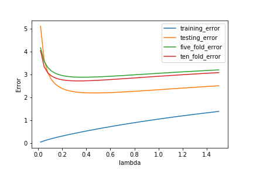

# K-Fold-CV-Experimentation-in-Ridge-Regression
The goal of this mini project is to experiment with the K-fold cross validation (CV) procedure to tune the penalty parameter λ in Ridge regression, without using any pre-defined packages from libraries like `scikit-learn`.

## Implementations include:
* `k-fold_cross_validation.py` Python source code.
* `data_test_X.csv, data_test_y.csv, data_train_X.csv, data_train_y.csv` datasets used.
* **`K-Fold-CV-Experimentation-in-Ridge-Regression.ipynb`** the final notebook.

